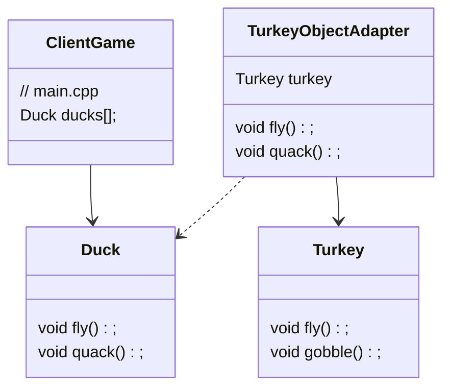
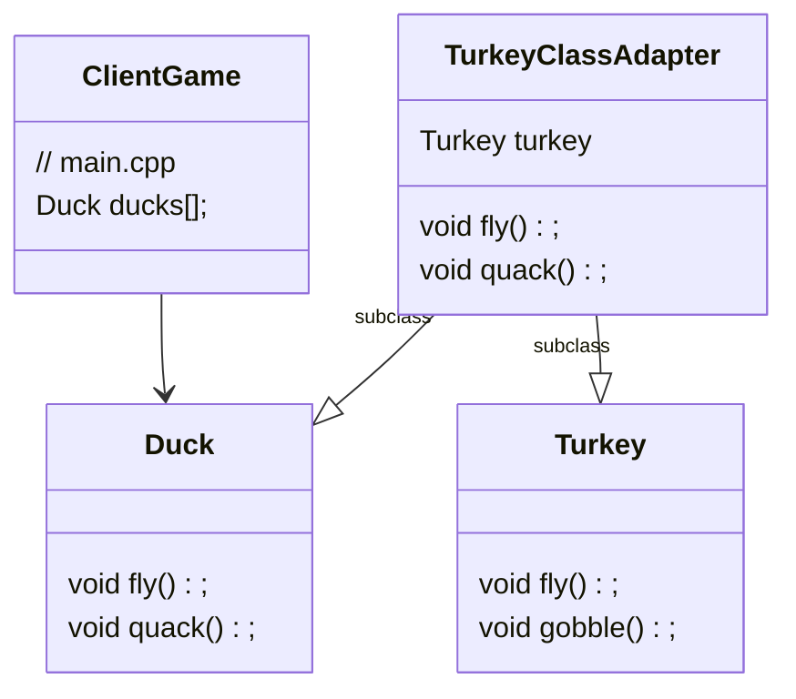

# Turkey and Duck

In this project, we will create an adapter that lets a turkey act like a duck.

## Class Diagram

### **Object Adapter**

### **Class Adapter**

- Class Adapter is quite complicated to create when there are methods with same names on both the Target and Adaptee interfaces
- Class Adapters are good when Target and Adaptee are completely different (For ex. Enumeration and Iterator interfaces in Java)