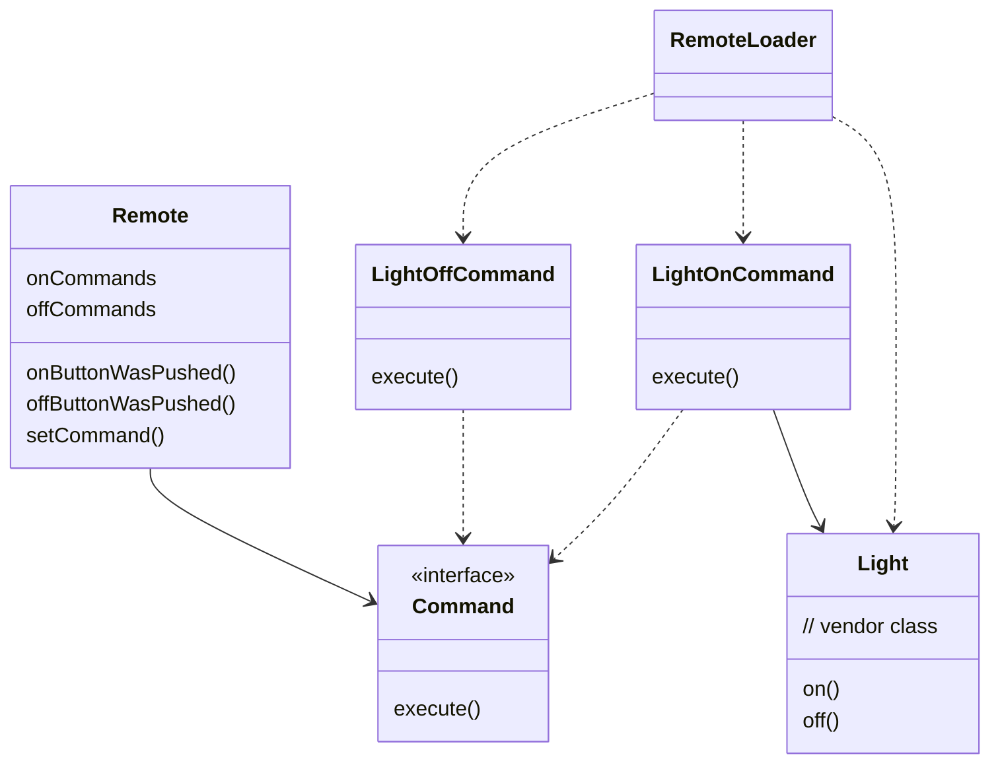

# Remote Control
Here we have a remote control that has on and off buttons for some home appliances, for example, TV, Living Room lights, Kitchen lights, Speakers, etc.

Every appliance has its own class and methods defined in it, but there is no standard followed while designing these different classes, so the method definition to turn on TV and Living Room lights might be different.

The objective is to design a Remote Control API, which has a pair of buttons (on and off), and each pair is assigned a particular device. Let's say it has unlimited slots for pair of buttons. Design a solution using the Command Pattern.

## Class Diagram

