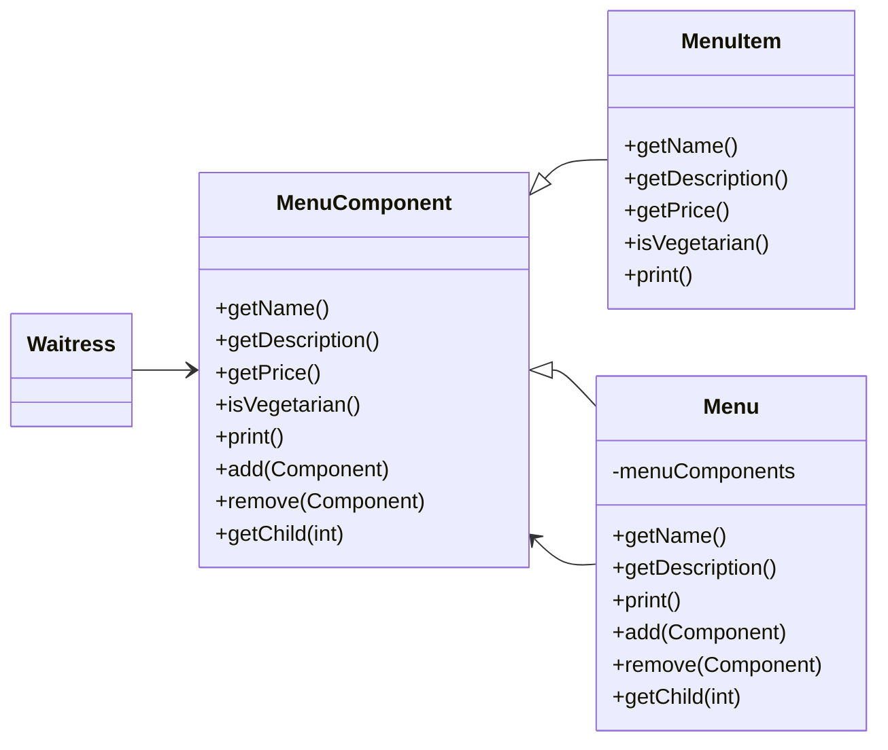

# Diner Menu and Sub-Menus

A common interface for Menu and Menu Items.

- MenuComponent represents the interface for both MenuItem and Menu, it is an abstract class because there will be default implementation of methods
- The Waitress will only interact with MenuComponent
- MenuItem overrides the methods that make sense for a menu item
- Why do we need default implementations? If the leaf (MenuItem) or the composite (Menu) doesn't want to implement some of the methods, they can fall back on some basic behavior

## But this is not Single responsibility! What's happenin?

Yeah, its true. This patterns throws Single-Responsiblity principle out of the water. But it is trade-off with *Transparency*.
Allowing the Component interface to contain child management operations and the leaf operations, a client can treat both composites and leaf nodes uniformly. It becomes transparent to the client.

