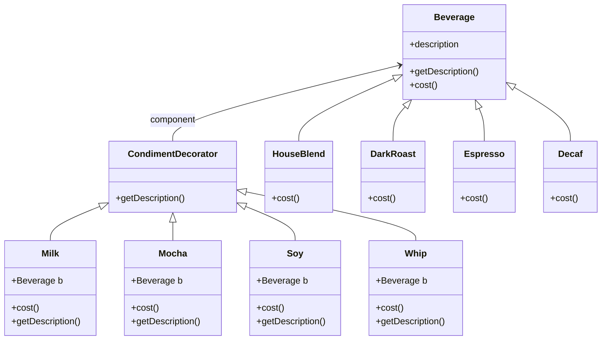

# Starbucks order system

```mermaid
classDiagram

class Beverage {
    +description
    +getDescription()
    +cost()
}

class CondimentDecorator {
    +getDescription()
}

class HouseBlend {
    +cost()
}

class DarkRoast {
    +cost()
}

class Espresso {
    +cost()
}

class Decaf {
    +cost()
}
Beverage <|-- HouseBlend
Beverage <|-- DarkRoast
Beverage <|-- Espresso
Beverage <|-- Decaf
Beverage <-- CondimentDecorator : component

class Milk {
    +Beverage b
    +cost()
    +getDescription()
}

class Mocha {
    +Beverage b
    +cost()
    +getDescription()
}

class Soy {
    +Beverage b
    +cost()
    +getDescription()
}

class Whip {
    +Beverage b
    +cost()
    +getDescription()
}

CondimentDecorator <|-- Milk
CondimentDecorator <|-- Mocha
CondimentDecorator <|-- Soy
CondimentDecorator <|-- Whip
```
