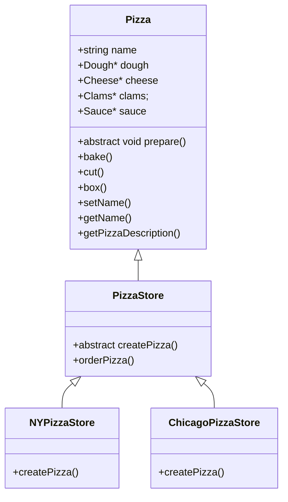
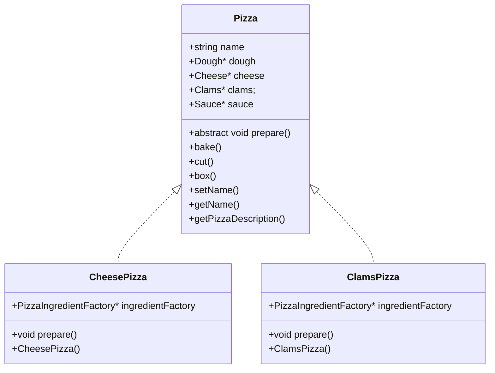
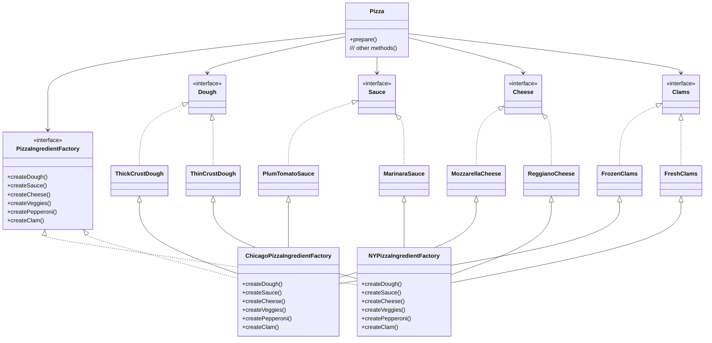

# Domino's Pizza - Low Level Design

## Pizza Store

```mermaid
classDiagram

class Pizza {
    +string name
    +Dough* dough
    +Cheese* cheese
    +Clams* clams;
    +Sauce* sauce
    +abstract void prepare()
    +bake()
    +cut()
    +box()
    +setName()
    +getName()
    +getPizzaDescription()
}

class PizzaStore {
    +abstract createPizza()
    +orderPizza()
}

Pizza <|-- PizzaStore 

class NYPizzaStore {
    +createPizza()
}

class ChicagoPizzaStore {
    +createPizza()
}

PizzaStore <|-- NYPizzaStore
PizzaStore <|-- ChicagoPizzaStore
```

## Types of Pizza
Name of the pizzas is same across all regions, but the ingredients differ.

```mermaid
classDiagram

class Pizza {
    +string name
    +Dough* dough
    +Cheese* cheese
    +Clams* clams;
    +Sauce* sauce
    +abstract void prepare()
    +bake()
    +cut()
    +box()
    +setName()
    +getName()
    +getPizzaDescription()
}

class CheesePizza {
    +PizzaIngredientFactory* ingredientFactory
    +void prepare()
    +CheesePizza()
}

class ClamsPizza {
    +PizzaIngredientFactory* ingredientFactory
    +void prepare()
    +ClamsPizza()
}

Pizza <|.. CheesePizza
Pizza <|.. ClamsPizza
```

## Pizza Ingredients - Abstract Factory

```mermaid
classDiagram

class PizzaIngredientFactory {
    <<interface>>
    +createDough()
    +createSauce()
    +createCheese()
    +createVeggies()
    +createPepperoni()
    +createClam()
}

class NYPizzaIngredientFactory {
    +createDough()
    +createSauce()
    +createCheese()
    +createVeggies()
    +createPepperoni()
    +createClam()
}

class ChicagoPizzaIngredientFactory {
    +createDough()
    +createSauce()
    +createCheese()
    +createVeggies()
    +createPepperoni()
    +createClam()
}

PizzaIngredientFactory <|.. NYPizzaIngredientFactory
PizzaIngredientFactory <|.. ChicagoPizzaIngredientFactory


class Pizza {
    +prepare()
    /// other methods()
}

class Dough
<<interface>> Dough
class ThickCrustDough
class ThinCrustDough
Dough <|.. ThickCrustDough
Dough <|.. ThinCrustDough

class Sauce
<<interface>> Sauce
class PlumTomatoSauce
class MarinaraSauce
Sauce <|.. PlumTomatoSauce
Sauce <|.. MarinaraSauce

class Cheese
<<interface>> Cheese
class MozzarellaCheese
class ReggianoCheese
Cheese <|.. MozzarellaCheese
Cheese <|.. ReggianoCheese

class Clams
<<interface>> Clams
class FrozenClams
class FreshClams
Clams <|.. FrozenClams
Clams <|.. FreshClams

ThickCrustDough <|-- ChicagoPizzaIngredientFactory
PlumTomatoSauce <|-- ChicagoPizzaIngredientFactory
MozzarellaCheese <|-- ChicagoPizzaIngredientFactory
FrozenClams <|-- ChicagoPizzaIngredientFactory

ThinCrustDough <|-- NYPizzaIngredientFactory
MarinaraSauce <|-- NYPizzaIngredientFactory
ReggianoCheese <|-- NYPizzaIngredientFactory
FreshClams <|-- NYPizzaIngredientFactory

Pizza --> PizzaIngredientFactory
Pizza --> Dough
Pizza --> Sauce
Pizza --> Cheese
Pizza --> Clams
```