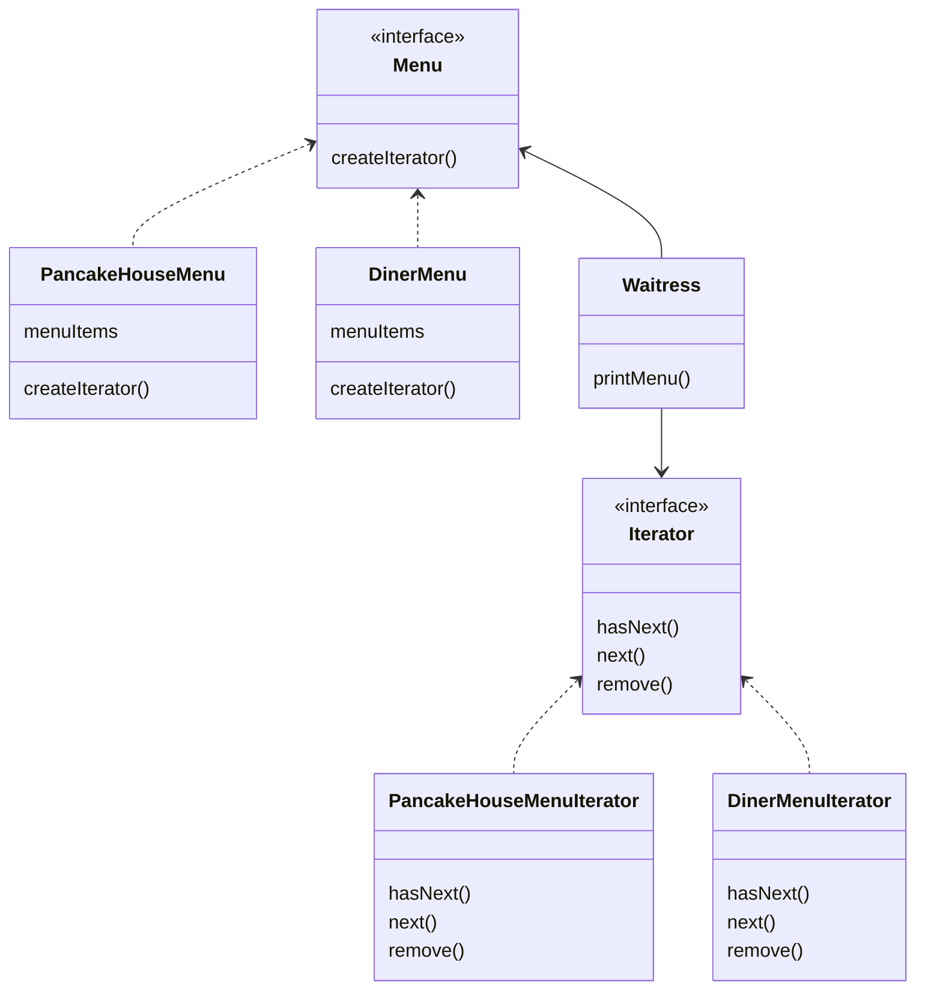

# Pancake and Diner Menu

Two of the famous restaurants (Pancake House and Diner) of the city are getting merged into one. But they have different ways to represent their menu items.

* Pancake House - uses a vector to represent its menu
* Diner - uses an array to represent its menu

You need to implement an iterator for these so that the Waitress class that you are going to create, can consume these menu item collections in the easiest way (scalable and maintainable). The implementation of the collections should be hidden from the waitress.

## Pancake House and Diner Menu

