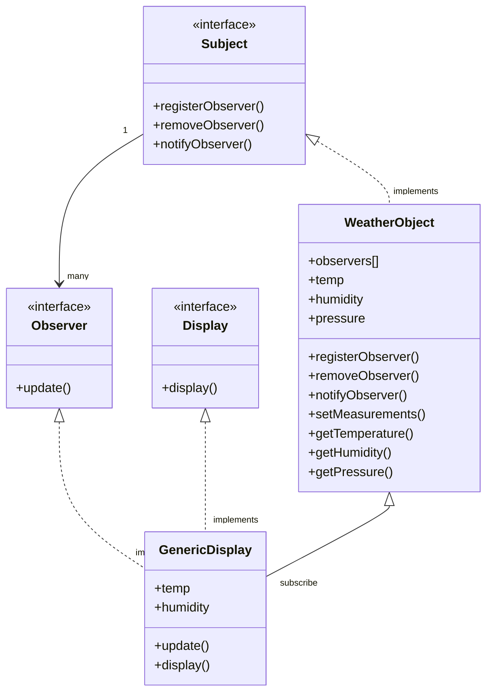

# Weather Station - The Observer Pattern

This is an example project that implements the Observer Pattern of OO design in C++.

In this project, the observers are allowed to *pull* data from the subject/publisher.

## Class Diagram

