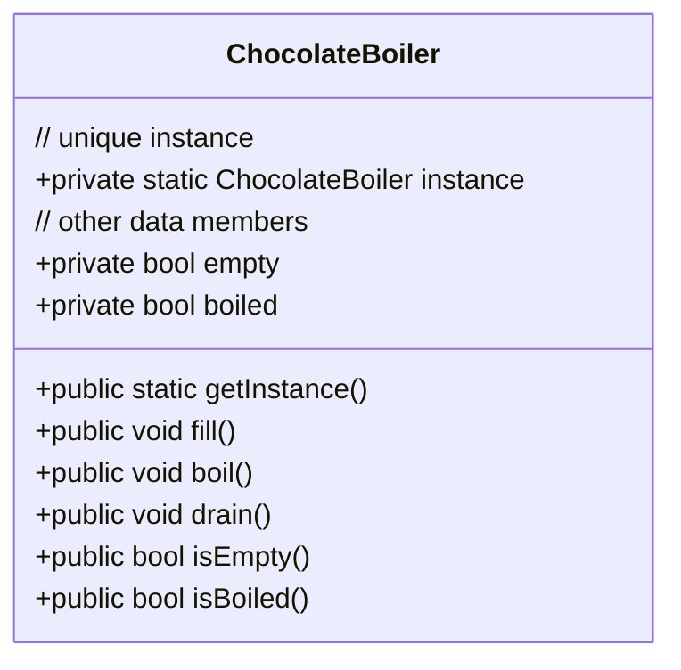

# The Chocolate Factory
In a chocolate factory, there are computer controlled boilers. The job of the boiler is to take in chocolate and milk, bring them to a boil and then pass them on to the next phase of making chocolate bars.

Imagine in our chocolate factory, there is only one boiler and multiple engineers can handle it via code. You need to make sure that no material is wasted and only a single instance is shared among all engineers.


---

However it is not always that easy. You have to ensure thread safety.

## Lazy initialization (Not thread safe)
```cpp
ChocolateBoiler* ChocolateBoiler::getInstance() {
    if(instance == nullptr) {
        instance = new ChocolateBoiler();
    }
    return instance;
}
```

## Eager instantiation (thread safe)
```cpp
// initialize the unique instance as soon as the class gets loaded
ChocolateBoiler* ChocolateBoiler::instance = new ChocolateBoiler();

// simply return the instance whenever getInstance() is called
ChocolateBoiler* ChocolateBoiler::getInstance() {
    return instance;
}
```

## Double-checked locking (thread safe)
```cpp
static std::shared_ptr<ChocolateBoiler> instance;
// mutex to provide exclusive access to instance
static std::mutex boilerMutex;

std::shared_ptr<ChocolateBoiler> ChocolateBoiler::getInstance() {
    if(instance == nullptr) {
        std::lock_guard<std::mutex> lock(boilerMutex);
        if(instance == nullptr) {
            instance.reset(new ChocolateBoiler());
        }
    }
    return instance;
}
```