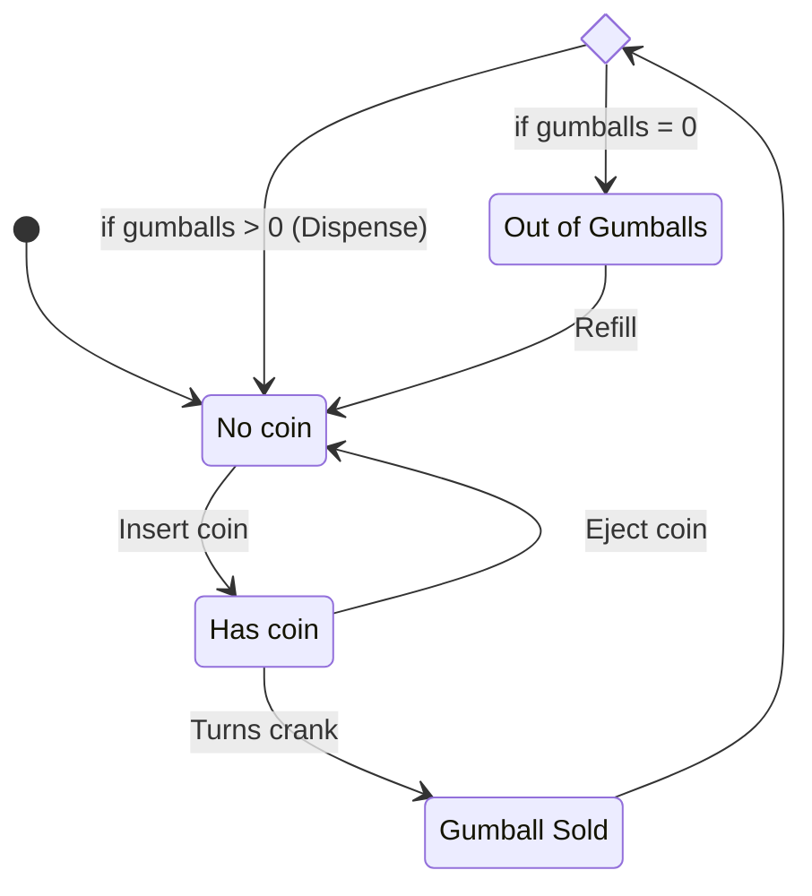
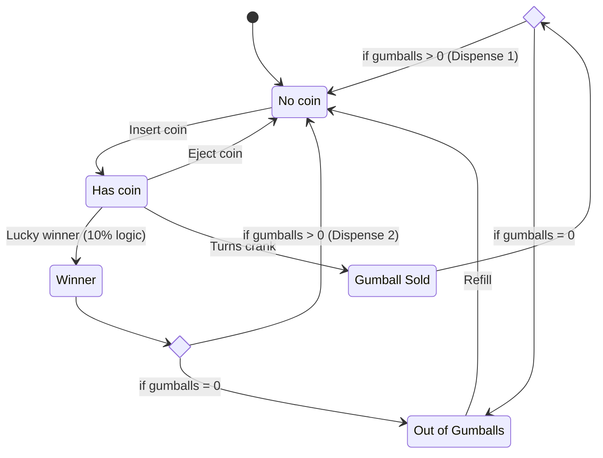
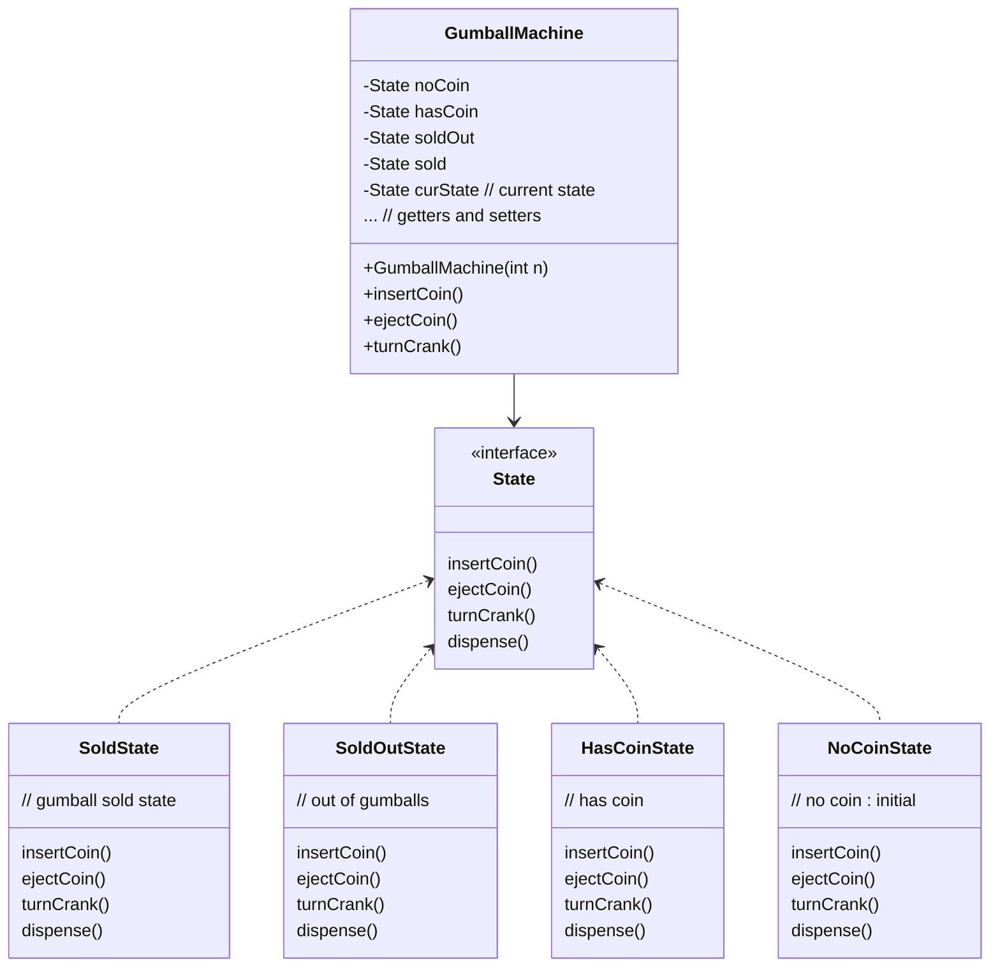

# Gumball Machine

Imagine we have a gumball machine (a machine that dispenses gum balls when you feed it a coin, similar to a vending machine). We have to write an interface for this Gumball Machine. The state diagram of the machine is given below:

## Gumball Machine state diagram

There are mainly 4 states:
1. No Coin
2. Has Coin 
3. Gumball sold
4. Out of gumballs (Sold out)

## Gumball Machine state diagram v2

Lucky winner (10% chance) to get 2 gumballs instead of 1

## Class Diagram

