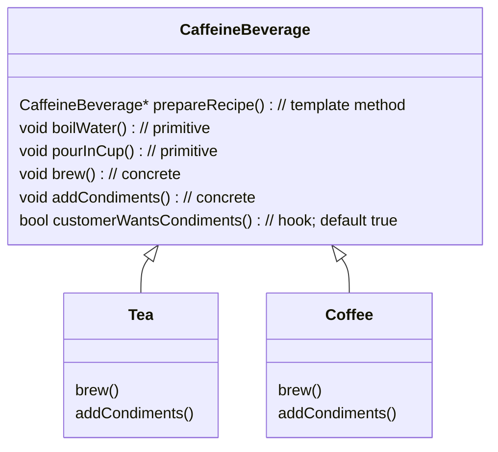

# Coffee and Tea

Creating a template method for making tea or coffee. The algorithm is quite similar for both, so lets give it a shot.



```cpp

// template method defines the algorithm
CaffeineBeverage* prepareRecipe() {
    boilWater();
    pourInCup();
    brew();
    addCondiments();
}

CaffeineBeverage* cuttingChai = new Tea();
cuttingChai->prepareRecipe();
```