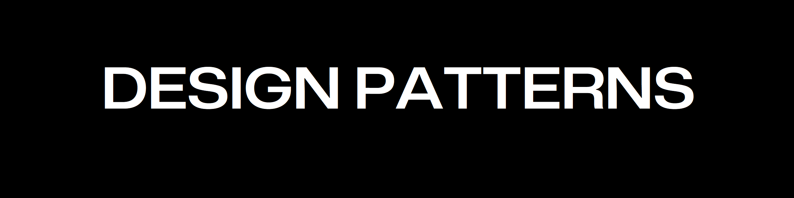

---

A collection of C++ projects implementing various object-oriented design patterns.

## How to run a project?
Go to the projects directory (i.e. ./Code/ObserverPattern)
- `install.sh` : compile and build
- `run.sh` : run the binary
### Compile and Build
```bash
cd ./Code/ObserverPattern
source install.sh
```

### Run
```bash
source run.sh
```

## Index

### Creational patterns
These patterns provide object creation mechanisms, which increase flexibility and reuse of existing code.

|Theory|Code|
|-|-|
|[Factory Pattern](./Theory/FactoryPattern.md)|[Domino's Pizza](./Code/FactoryPattern)|
|[Singleton Pattern](./Theory/SingletonPattern.md)|[Chocolate Factory](./Code/SingletonPattern)|

---

### Structural patterns
These patterns explain how to assemble objects and classes into larger structures while keeping these structures flexible and efficient.

|Theory|Code|
|-|-|
|[Decorator Pattern](./Theory/DecoratorPattern.md)|[Starbucks Coffee](./Code/DecoratorPattern)|
|[Adapter Pattern](./Theory/AdapterPattern.md)|[Turkey and Duck](./Code/AdapterPattern)|
|[Facade Pattern](./Theory/FacadePattern.md)|-|
|[Composite Pattern](./Theory/CompositePattern.md)|[Diner Menu and Sub-Menus](./Code/CompositePattern)|


---

### Behavioral patterns
These patterns are concerned with algorithms and the assignment of responsibilities between objects.

|Theory|Code|
|-|-|
|[Strategy Pattern](./Theory/StrategyPattern.md)|[Duck Simulator](./Code/StrategyPattern/)|
|[Observer Pattern](./Theory/ObserverPattern.md)|[Weather Station](./Code/ObserverPattern)|
|[Command Pattern](./Theory/CommandPattern.md)|[Remote Control](./Code/CommandPattern)|
|[Iterator Pattern](./Theory/IteratorPattern.md)|[Pancake and Diner Menu](./Code/IteratorPattern)|
|[Template Pattern](./Theory/TemplatePattern.md)|[Coffee and Tea](./Code/TemplatePattern)|
|[State Pattern](./Theory/StatePattern.md)|[Gumball Machine](./Code/StatePattern)|

---