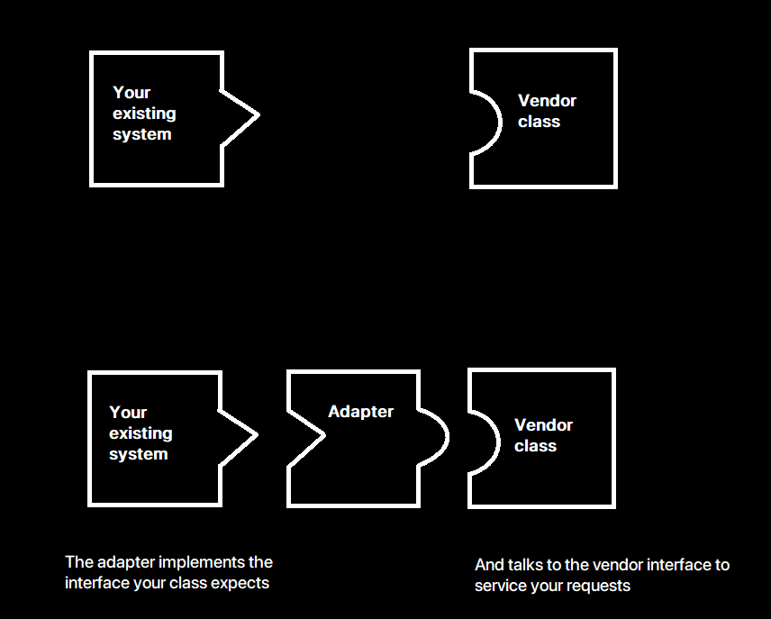
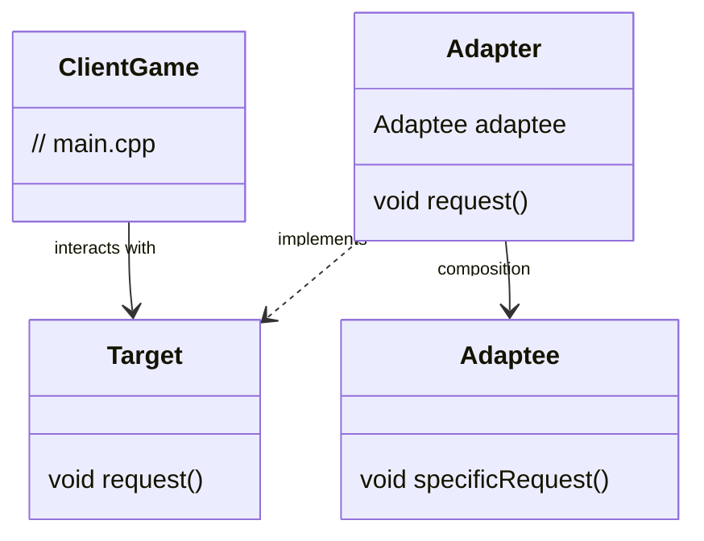

# The Adapter Pattern

## C++ Project Example
Link: [Turkey and Duck](../Code/AdapterPattern/)

## Theory

The Adapter Pattern converts the interface of a class into another interface the clients expect. Adapter lets clases work together that couldn't otherwise because of incompatible interfaces.

## Object and Class Adapters

1. **Object Adapters**: The Adapter class is composed with the object of Adaptee
2. **Class Adapters**: The Adapter class subclasses both the Target and Adaptee interfaces

## Class Diagram

