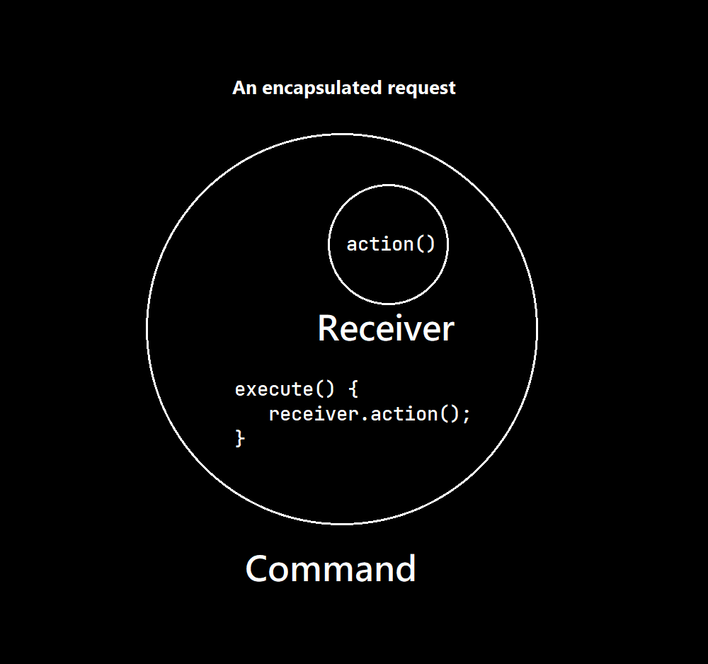
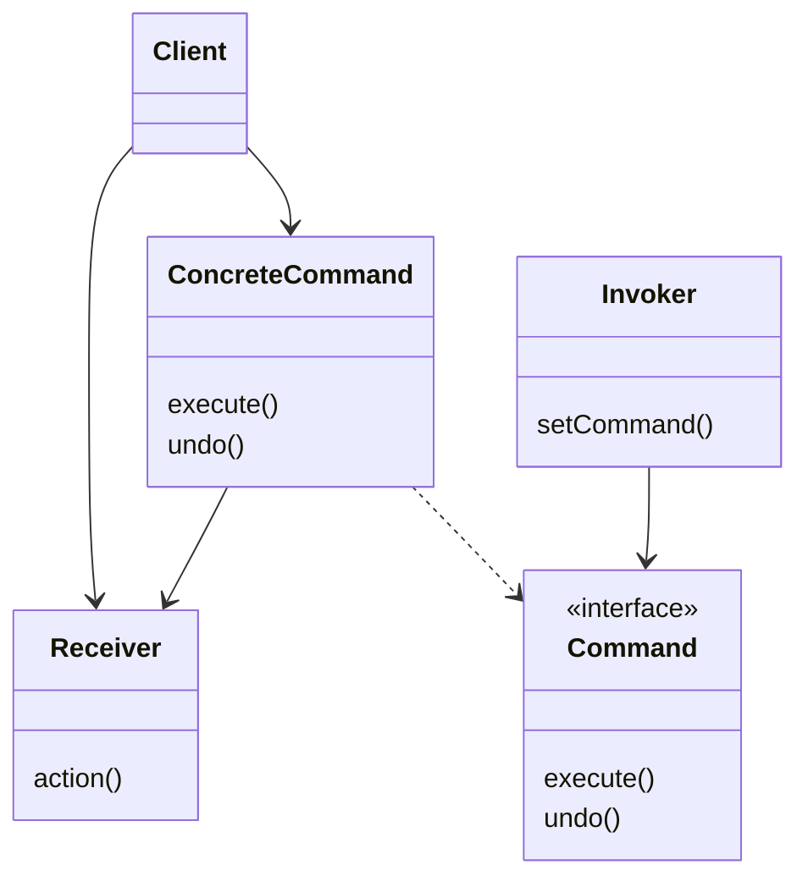

# The Command Pattern

## C++ Project Example
Link: [Remote Control](../Code/CommandPattern/)
This pattern encapsulates a request as an object, thereby letting you parameterize other objects with different requests, queue or log requests, and support undoable operations.

## Class Diagram

* Command declares an interface for all commands, it has an execute() and undo() method
* The execute() method of a ConcreteCommand eventually calls the action() of Receiver
* The ConcreteCommand defines a binding between an action and a receiver
* The Client is responsible for creating a ConcreteCommand and setting its Receiver
* The Invoker holds a command and at some point asks the command to call its execute() method
* The Receiver knows how to perform the work needed to carry out the request
* The Invoker of the request and the Receiver of the request are decoupled