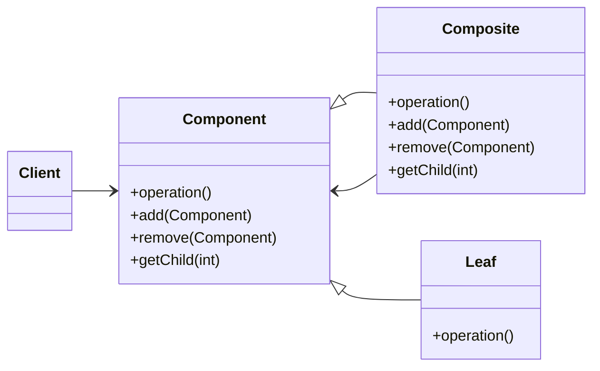

# The Composite Pattern

## C++ Project Example
Link: 

## Theory

The Composite pattern allows you to compose objects into tree structures to represent part-whole hierarchies. Composite lets clients treat **individual objects** and **compositions of objects** uniformly.

Composite pattern provides a mechanism for treating groups of objects the same as an individual object (this is often known as part-whole hierarchy). 

The Composite pattern allows us to build structures of objects in the form of trees that contain both **compositions of objects** and **individual objects** as nodes.

Using a composite structure, we can apply the same operations over both composites and individual objects. In other words, in most cases we can **ignore** the difference between composition of objects and individual objects.

## Class Diagram

