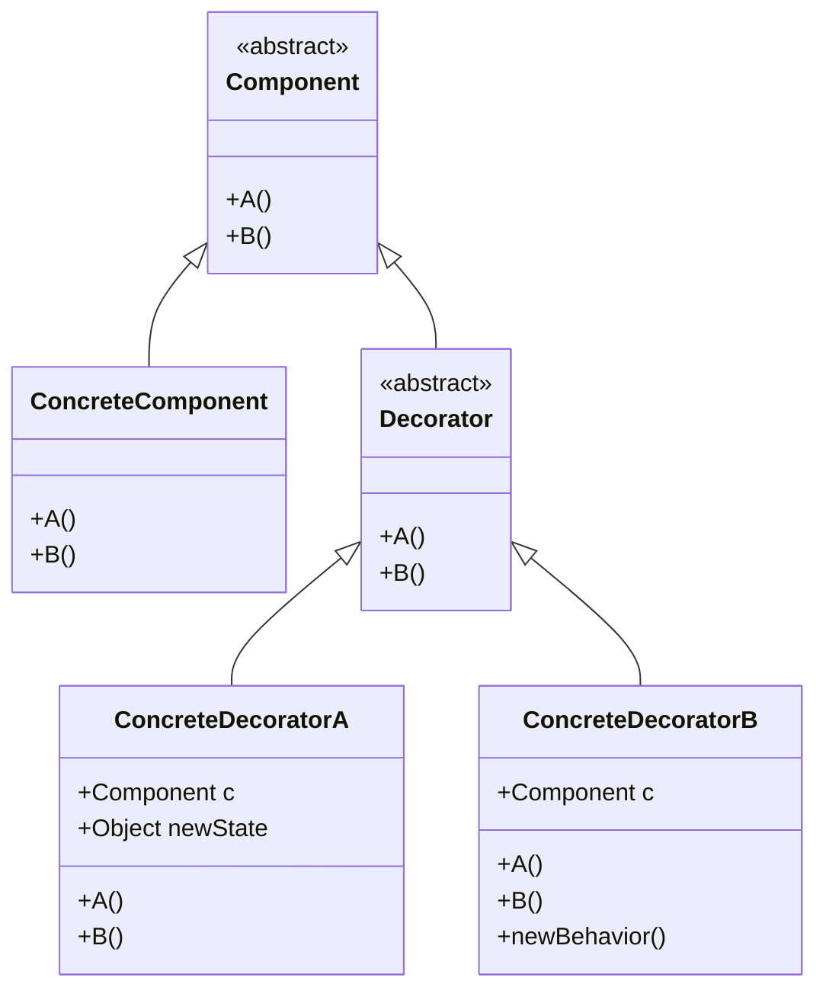
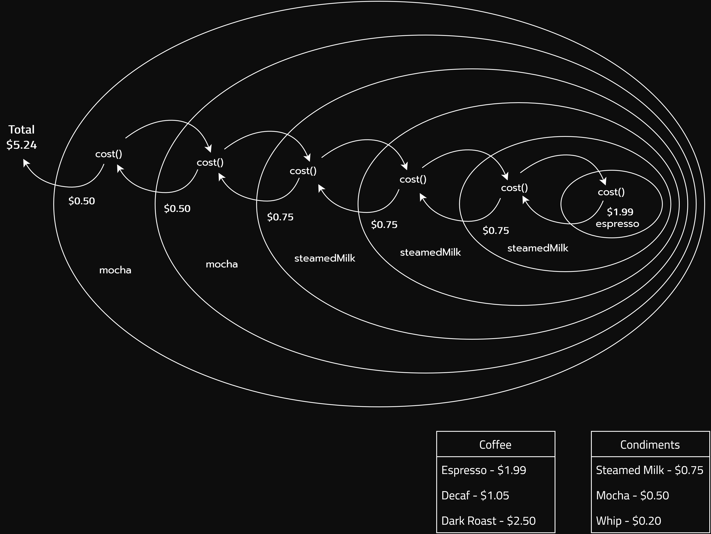

# The Decorator Pattern

## C++ Project Example
Link: [Starbucks Order System](../Code/DecoratorPattern/)

## Theory

The goal is to allow classes to be easily extended to incorporate new behavior without modifying existing code. This is also known as Open-Closed Principle (the 'O' in SOLID principles).

### What do we get if we accomplish this?
Designs that are resilient to change and flexible enough to take on new functionality to meet changing requirements.

## Definition
The Decorator Pattern attaches additional responsibilities to an object dynamically. Decorators provide a flexible alternative to subclassing for extending functionality.

## Key points to remember
- Decorators have the same supertype as the objects they decorate
- One or more decorators can be used to wrap an object
- Given that the decorator has the same supertype as the object it decorates, we can pass around a decorated object in place of the original (wrapped) object
- The decorator adds its own behavior either before and/or after delegating to the object it decorates to do the rest of the job
- We can decorate objects dynamically at runtime with as many decorators as we like

## Class Diagram

## Decorating a coffee

Imagine you are Starbucks and you order:

*an iced, Ristretto, 10 shot, venti, with breve, 5 pump vanilla, 7 pump caramel, 4 Splenda, [and] poured, not shaken*

You deserve to be dragged out from the shop.

For this example, we will consider a simpler order

*double mocha triple steamed milk espresso*

(idk if this is even a thing but anyway)

The cost will be calculated in this way:

