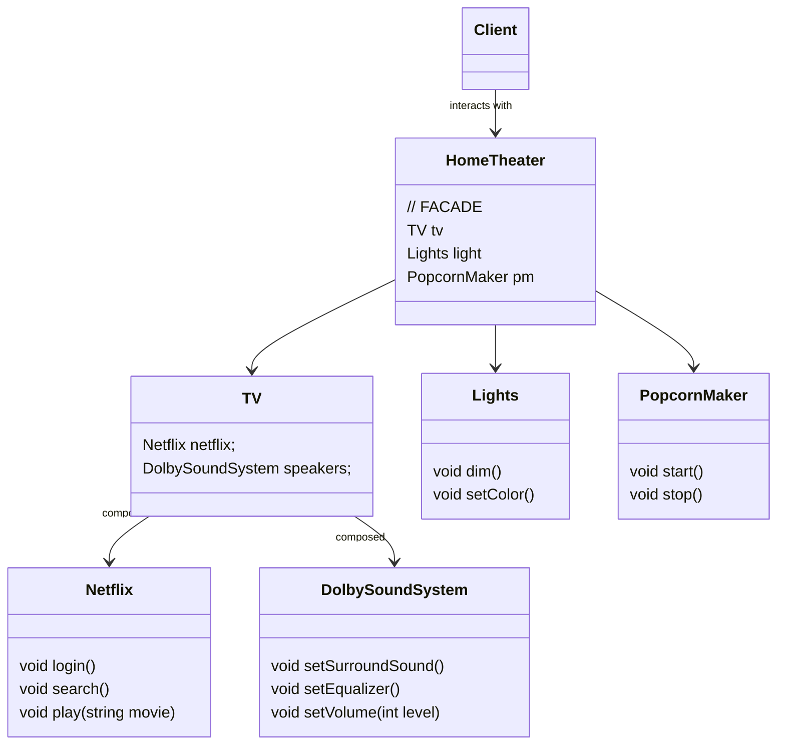

# The Facade Pattern

There is no code example for this, as this is a pretty straightforward pattern. Look at the class diagram, its easy af. Just composition.

## Theory
The Facade Pattern provides a unified interface to a set of interfaces in a subsystem. Facade defines a higher-level interface that **makes the subsystem easier to use**.

It avoids tight coupling between clients and subsystems. It also helps to adhere to a OO principle.

---
## Principle of Least Knowledge - **talk only to your immediate friends** 

It means when you are desiging a system, for any object, be careful of the number of classes it iteracts with and also how it comes to interact with those classes.

This principle prevents us from creating designs that have a large number of classes coupled together so that changes in one part of the system cascade to other parts. A lot of interdependencies between classes, makes the system fragile and costly to maintain.

For example. 
```cpp
float getTemp() {
    return station.getThermometer().getTemperature();
}
```
This is a bad design, since, any change in the `getTemperature()` method of `Temperature` class, cascades to this method. The coupling is too tight.

---

## Key points

How to actually use the principle of least knowledge?

Take any object; now from any method in that object, the principle tells us that we should only invoke methods that belong to:
- The object itself
- Objects passed in as a perameter to the method
- Any object the method creates or instantiates
- Any components of the object

So a good design for the above `getTemp()` method would be: 
```cpp
float getTemp() {
    return station.getTemperature();
}
```


## Class Diagram


