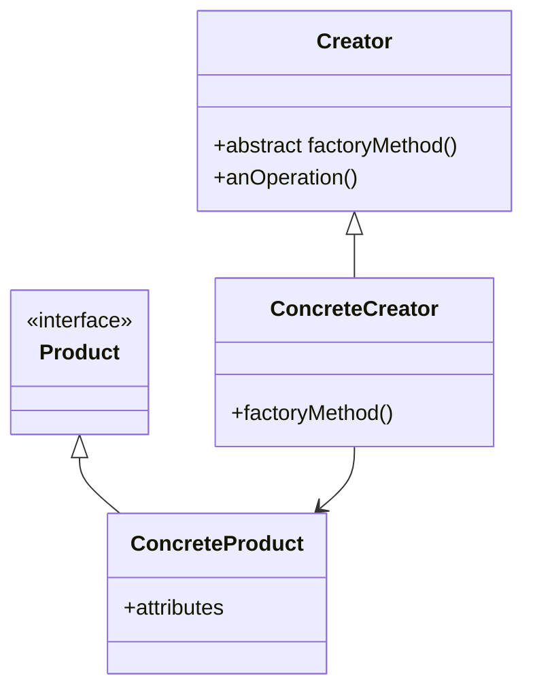

# The Factory Method Pattern

## C++ Project Example
Link: [Pizza Business](../Code/FactoryPattern/)

## Theory

The Factory Method Pattern defines an interface for creating an object, but lets subclasses **decide** which class to instantiate. Factory Methods lets a class defer instantiation to subclasses.

This pattern gives us a way to encapsulate the instantiations of concrete types. A general class diagram is given below:

