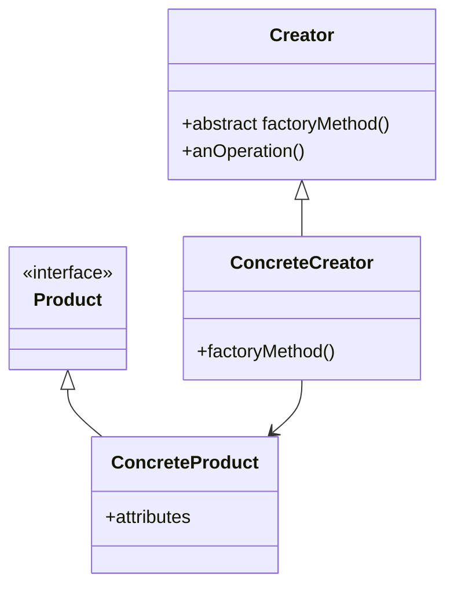
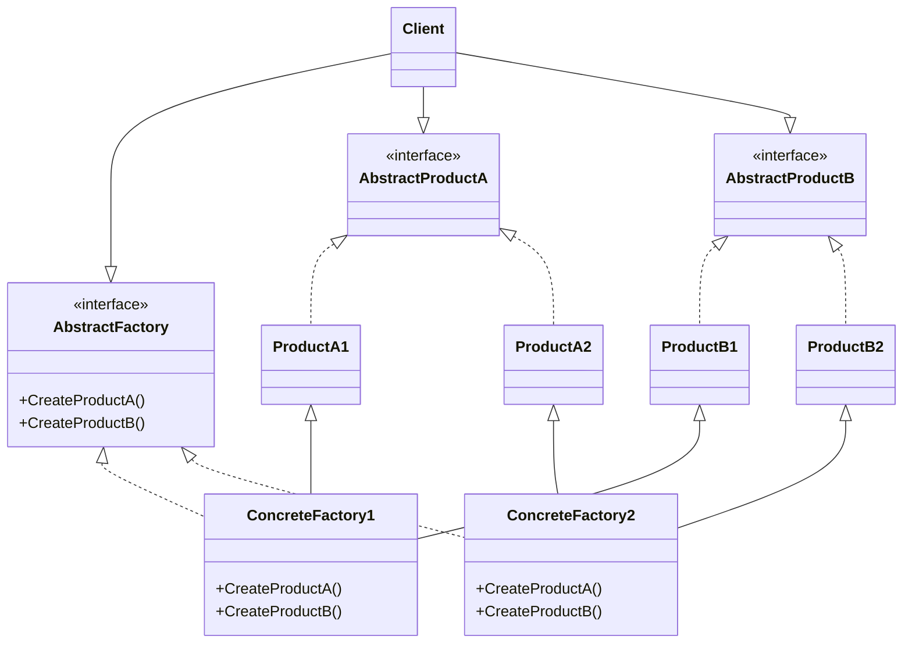

# The Factory Method Pattern

## C++ Project Example
Link: [Pizza Business](../Code/FactoryPattern/)

## Theory

The Factory Method Pattern defines an interface for creating an object, but lets subclasses **decide** which class to instantiate. Factory Methods lets a class defer instantiation to subclasses.

This pattern gives us a way to encapsulate the instantiations of concrete types. A general class diasgram is given below:

- The Creator is a class that contains the implmentations for all of the methods to manipulate products, except for the **factory method**
- All products must implement the same interface so that the classes which use the products can refer to the interface, not the concrete class
- The abstract **factoryMethod()** is what all Creator subclasses must implement
- The ConcreteCreator implements the **factoryMethod()**, which is the method that actually produces products
- The ConcreteCreator is responsible for creating one or more concrete products. it is the only class that has the knowledge of how to create these products

## Dependency Inversion Principle
Depend upon Abstractions, do not depend upon Concrete Classes.

## Guidelines to follow the principle
- No variable should hold a reference to a concrete class
- No class should derive from a concrete class
- No method should override an implemented  method of its base classes

# Abstract Factory Pattern
The Abstract Factory Pattern provides an interface for creating families of related or dependent objects without specifying their concrete classes.

Abstract Factory allows a client to use an abstract interface to create a set of related products without knowing (or caring) about the concrete products that are actually produced.

