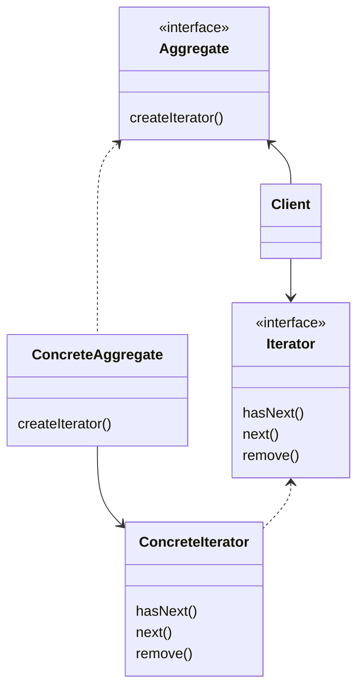

## The Iterator Pattern

## C++ Project Example
Link: [Pancake and Diner Menu](../Code/IteratorPattern/)

## Theory

The Iterator Pattern provides a way to access the elements of an aggregate object sequentially without exposing its underlying representation.

It also places the task of traversal on the iterator object, not on the aggregate, which simplifies the aggregate interface and implementation, and places the responsibility where it should be.

- The iterator interface provides the interface that all iterator must implement, and a set of methods for traversing over elements of a collection.
- The ConreteIterator is responsible for managing the current position of the iteration
- Each ConcreteAggregate is responsible for instantiating a ConcreteIterator that can iterator over its collection of objects
- The client interacts with the Aggregate and iterator interfaces only, it decouples from the behind the scenes implementation