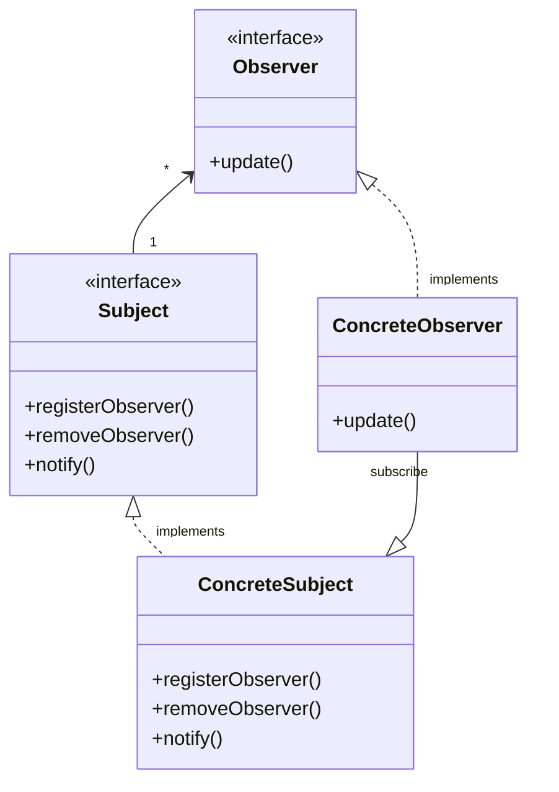

# The Observer Pattern

## C++ Project Example
Link: [The Weather Station](../Code/ObserverPattern/)

## Theory
It defines a one-to-many dependency between objects so that when one object changes state, all of its dependents are notified and updated automatically.

The relationship between subject and observers is one-to-many. Whenever the state of the subject changes, all the observers are notified.

This pattern is also known as, 
- Subject-Observer
- Publisher-Subscriber

The general class diagram is given below.
- There are 2 interfaces, one for Subject and one for Observer
- The class that will implement the Subject interface need to define the functions for registering observer, removing observer and notifying observers
- There are 2 ways to get updated state in the observers
    - Either the subject *pushes* the state to observers
    - Or the observers *pull* the data from the subject state
    - pull is considered more correct as it allows observers to only fetch the data that they need.
- Meanwhile, the classes implementing observer interface need to define the update method
- In this way, the two objects are loosely coupled, they can interact, but have very little knowledge of each other.
- Changes to either the subject or an observer will not affect the other

## Some key points to remember
- Strive for loosely coupled designs between objects that interact
- Loosely coupled designs allow us to build flexible OO systems that can handle change because they minimize the interdependency between objects
- **Publishers + Subscribers = Observer Pattern**