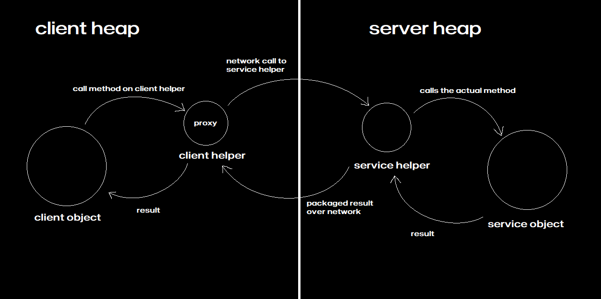
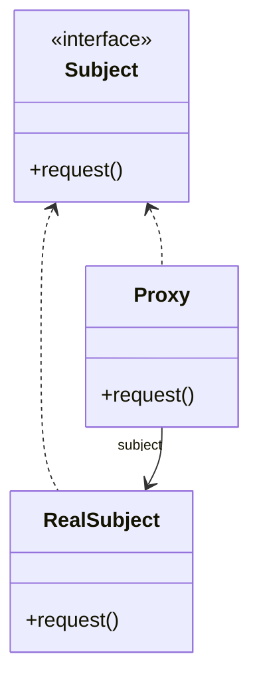

# The Proxy Pattern

## Java Project Example
Link: [Gumball Machine Monitoring](../Code/ProxyPattern/)

## Theory

### What is a remote proxy?
- A remote proxy acts as a *local representative to a remote object*. A remote object lives in the heap of a different address space.
- Local Representative is an object that you can call methods on and have them forwarded on to the remote object.

## Remote Method Call

### Java RMI (Remote Method Invocation)
- RMI creates the client and service helper objects
- Creates the client helper object with the same methods as the remote service
- No need to write networking I/O code
- RMI Nomenclature
    - Client helper is called **STUB**
    - Service helper is called **SKELETON**

## Definition
The Proxy Pattern provides a surrogate or placeholder for another object to control access to it.

Use the proxy pattern to create a representative object that controls access to another object, which 
- may be remote
- expensive to create or 
- in need of securing.

There are many variations of Proxy Pattern and they typically revolve around the way the proxy "controls access". 

Some of these variations are

- A remote proxy controls access to a remote object
- A virtual proxy controls access to a resource that is expensive to create
- A protection proxy controls access to a resource based on access rights

- Both the Proxy and Real Subject implement the Subject interface. This allows any client to treat the proxy just like the real subject
- The Real Object is usually the object that does most of the real work; the Proxy controls access to it
- The Proxy often instantiates or handles the creation of the Real Subject
- The Proxy keeps a reference to the Subject, so it can forward requests to the Subject when necessary