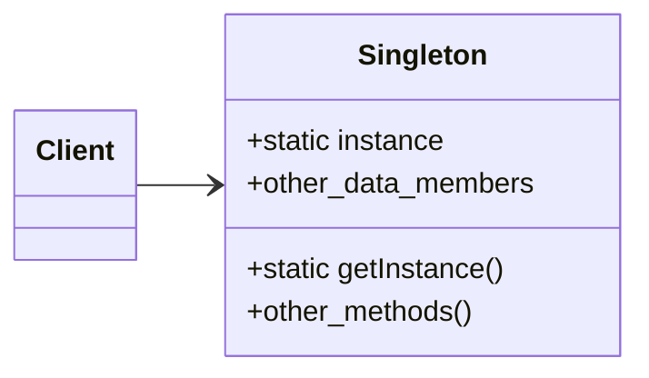

# The Singleton pattern

## C++ Project Example
Link: [Chocolate Factory](../Code/SingletonPattern/)

The Singleton pattern ensures a class has only one instance, and provides a global point of access to it.

The most common reason for implementing Singleton is to control access to a shared resource - for example, a database or a file.

## Points to remember
- Use the Singleton pattern when a class in your program should have just a single instance available to all clients; for example, a single database object shared by different parts of the program
- Use the Singleton pattern when you need stricter control over global variables
- Make sure your Singleton implementation is **thread safe**

