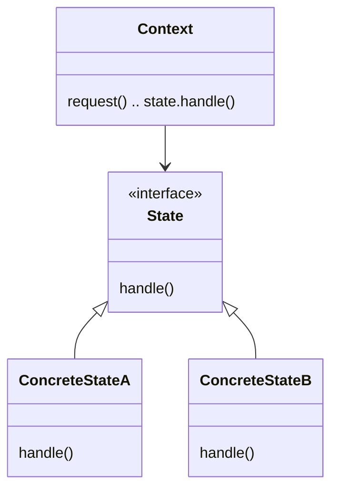

# The State Pattern

## C++ Project Example
Link: [Gumball Machine](../Code/StatePattern/)

## Theory

The State Pattern allows an object to alter its behavior when its internal state changes. The object will appear to change its class.

From the client's perspective, when the state changes, it appears as if the client is dealing with a brand new class, since it has completely new behavior.

## Class Diagram

- The Context is the class that can have a number of internal states
- Whenever request() is called, it is delegated to the state to handle
- Concrete States handle requests from the Context
- Each concrete state provides its own implementation for a request, in this way when the context changes state, its behavior also changes

---

## Difference between Strategy and State pattern
- Strategy Pattern is a flexible alternative to subclassing. You can change the behavior by composing with a different object
- State Pattern is an alternative to putting lots of conditionals in your context. You can simply change the state object in context to change its behavior