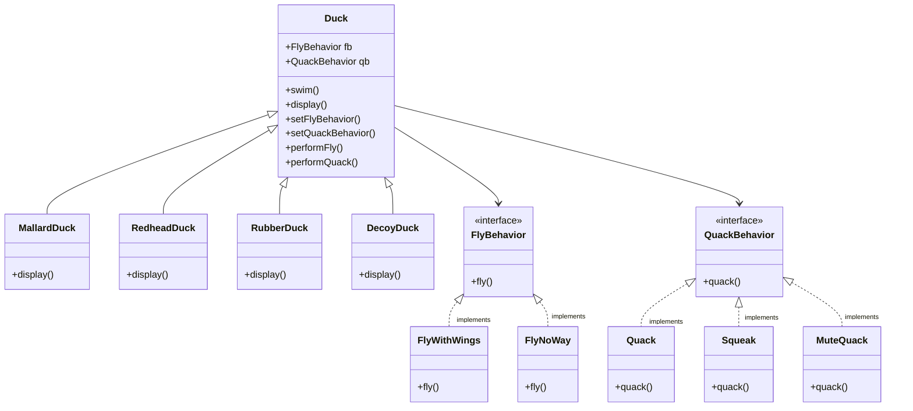

# The Strategy Pattern

## C++ Project Example
Link: [Duck Simulator](../Code/StrategyPattern/)

## Theory
It defines a family of algorithms, encapsulates each one, and makes them interchangeable. Strategy lets the algorithm vary independently from the clients that use it.

For example, in the below diagram, the behavior classes (FlyBehavior and QuackBehavior) can vary independently from the Duck class.

## Some key points to remember
- Identify the aspects of your application that vary and separate them from what stays the same
- Program to an interface, not an implementation
- Favor composition over inheritance

