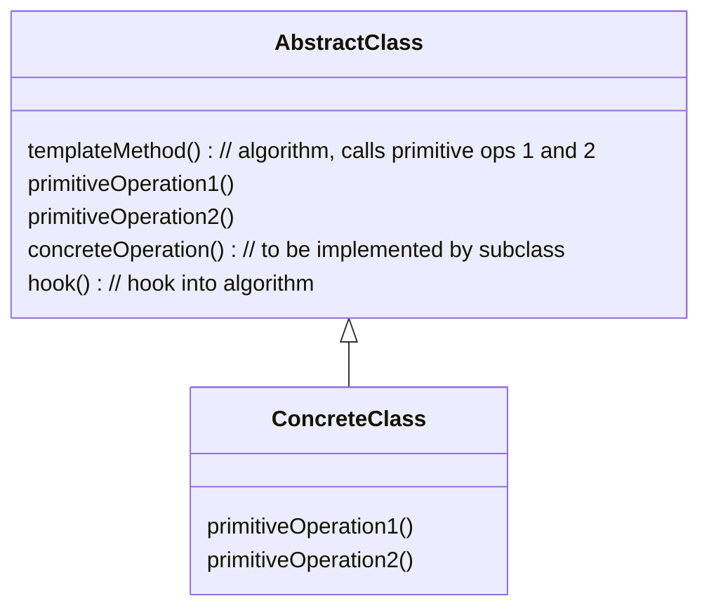

# The Template Pattern

## C++ Project Example
Link: [Coffee and Tea](../Code/TemplatePattern/)

## Theory

The Template Method Pattern defines the skeleton of an algorithm in a method, deferring some steps to subclasses. Template Methods lets subclasses redefine certain steps fo an algorithm without changing the algorithm's structure.

What's a template? It's just a method that defines an *algorithm* as a set of steps.

- **primitive operations**: methods that are common in the algorithm
- **concrete operations**: methods that need to be modified/implemented by subclasses
- **hooks**: method that gives subclasses an ability to hook into the algorithm at various points; default implementation is provided by template method (look at the code example for a clear picture of what a hook does)

## The Hollywood Principle

Don't call us, we'll call you.

---

This principle gives us a way to prevent "dependency rot". 

With this principle, we allow low-level components to hook themselves into a system, but the high-level components determine when they are needed, and how. In simpler words, the high-level components give the low-level components "*don't call us we'll call you*" treatment.

The template method call methods of its own and low-level components (subclasses).

---